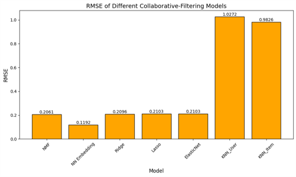

# Build a Personalized Online Course Recommender System with Machine Learning

## 1. Introduction

### Project background and context

The landscape of online education is rapidly evolving, offering a diverse array of courses to learners worldwide. However, the vast number of available courses can overwhelm students, making it challenging to find courses tailored to their interests and professional goals. This is where recommendation systems become invaluable.

The project's background revolves around developing a personalized online course recommender system leveraging machine learning techniques. By analyzing user interactions, course content, and enrollment data, we aim to devise a system that intelligently recommends courses to users based on their preferences and learning patterns.

### Problem Statement

The primary problem we address is improving the discovery of relevant online courses for learners. Traditional search methods leave users to navigate through extensive catalogs without personalized guidance. This can hinder their learning experience and impede the enrollment in suitable, beneficial courses.

Moreover, user engagement and course completion rates can drop if students encounter content that does not resonate with their learning styles or needs. Therefore, creating a recommender system that accurately predicts and suggests courses becomes essential in enhancing user engagement and educational outcomes.

### Hypotesis

- Utilizing textual data from course descriptions and genres, such as a Bag of Words (BoW) model, can effectively represent courses and help measure similarity between them, thus improving the recommendation quality.

- Crafting a multi-faceted recommendation engine using collaborative filtering methods like KNN, NMF, and neural network embeddings can outperform traditional, non-personalized course discovery methods in terms of user satisfaction and course enrollment rates.

- Building a hybrid model that combines content information with collaborative signals will provide more accurate predictions and a broader recommendation spectrum compared to using single-source information.

## 2. Exploratory Data Analysis

### Course Count per genre

This bar chart displays the quantity of online courses across various genres in our database. On the x-axis, we categorize courses by genre, such as "Backend Dev," "Machine Learning," "Database," etc. The y-axis measures the course count for each genre.

The distribution suggests a robust emphasis on development and data-centric subjects, reflecting industry demand and learning trends. It is also noteworthy that while the offerings are technology-heavy, there is an opportunity for expansion into nascent fields to cater to evolving market needs and learner interests.

### Course enrollment distribution

This histogram illustrates the frequency of enrollments varying by the number of courses users have signed up for. The x-axis represents the enrollment quantity, ranging from a user enrolled in just one course to users enrolled in over 61 courses. The y-axis shows the count of users within each enrollment range.

The histogram provides a clear picture of user engagement across the platform and indicates the challenge of converting single-course users into repeat learners. This trend highlights potential opportunities for targeted marketing strategies, user engagement programs, and personalized course recommendations that could encourage users to explore additional content beyond their initial course.

### 20 most popular courses

This slide enumerates the top 20 most popular courses on our platform as determined by the number of enrollments. These courses not only reflect current learner interests but also embody the key knowledge areas vital in today's digital economy.
The dominance of data science and coding courses demonstrates the compelling demand for technical skill development, with Python and data science serving as foundational subjects. The variety of course topics among the most enrolled courses also provides a window into emerging areas of interest, such as blockchain and cloud technologies, and underlines the need for lifelong learning in a fast-evolving technological landscape.

### Word cloud of course titles

The word cloud on this slide represents the frequency of keywords found within the titles of courses in our online platform's catalog. The size of each word in the cloud corresponds to its frequency, with larger words depicting more common terms.

## 3. Content-based Recommender System using Unsupervised Learning

### Flowchart of content-based recommender system using user profile and course genres

**Data Collection**: Acquire user data, including course enrollment history and user ratings, as well as detailed course metadata such as genres and descriptions.

**Feature Extraction**: Transform the textual metadata for each course into genre vectors. Simultaneously, build user profile vectors based on individual user's ratings and interactions with various courses.

**Similarity Computation**: Employ algorithms (e.g., cosine similarity) to calculate the similarity between user profiles and course genre vectors.

**Recommendation Generation**: Rank courses for each user based on similarity scores. The system suggests courses that align closely with the user's profile, indicating probable interest and relevance.

**Model Evaluation**: Compare system recommendations with actual user enrollments and feedback to assess accuracy and fine-tune model parameters.

**Feedback Loop**: Incorporate user feedback to update the profiles and refine the recommender system, ensuring recommendations evolve to match user preferences.

### Evaluation results of user profile-based recommender system

### Flowchart of content-based recommender system using course similarity

**Extract Course Features**: We start by processing course titles, descriptions, and genres to extract relevant features that numerically represent each course.

**Calculate Course Similarity**: Once we have feature vectors for all courses, we compute similarity scores that quantify how closely courses relate to one another.

**Rank Courses**: Using these similarity scores, we rank courses for each user based on how closely they align with the user's previous activities and stated preferences.

**Filter Top-N**: For each user, we retrieve the top N courses with the highest similarity scores that the user hasn't interacted with yet.

**User Feedback**: Users receive personalized course recommendations and have the opportunity to provide feedback on their relevance.

**Update Recommendations**: The system incorporates this feedback to refine subsequent recommendations, creating a dynamic learning experience that adapts to changing user needs.

### Evaluation results of course similarity based recommender system

### Flowchart of clustering-based recommender system

**Data Collection**: The first step involves loading necessary data, including a course similarity matrix, course content and metadata and user enrollment data.

**Mappings Preparation**: We then establish mappings between course IDs and their indices in the similarity matrix.

**Identify Courses for Each User**: For each test user in the dataset, we identify the courses they are enrolled in and those they haven't selected or interacted with.

**Recommendation Generation**: For each user, the system iterates over unselected courses and compares them with the enrolled courses using the similarity matrix. Courses with similarity scores above a defined threshold are added to the user's recommendation list.

**Data Aggregation**: The recommendations generated for each user are then compiled into a comprehensive dataset.

**Results Analysis**: Firstly, it calculates the average number of new course recommendations made to each user. Secondly, it identifies the top-10 courses that are most frequently recommended across all users. This step provides a measure of the system's effectiveness and the popularity of certain courses.

### Evaluation results of clustering-based recommender system

## 4. Collaborative-filtering Recommender System using Supervised Learning

### Flowchart of KNN based recommender system

**Preprocess Data**: The matrix is converted from a dense to a sparse format for efficient processing. Ratings are normalized if needed.

**Split Data**: The dataset is divided into training and testing sets to evaluate the model's performance.

**KNN Model Setup**: The type of KNN algorithm (user-based or item-based) is chosen, and hyperparameters like the number of neighbors and similarity metrics are set.

**Model Training**: The KNN model is trained on the training set. During this phase, the algorithm calculates similarities among users or items based on their interaction history.

**Predict and Evaluate**: The trained model predicts ratings for the test set. Evaluation metrics such as Root Mean Square Error (RMSE) are used to assess the accuracy of these predictions.

**Output Results**: The final step involves displaying the prediction accuracy. The system can also provide top course recommendations for users based on their preferences and similarities with others.

### Flowchart of NMF based recommender system

**Preprocess Data:** The initial step involves loading the dataset comprising user-item interactions. The data is then converted into a sparse matrix format, which is more efficient for handling large datasets. Normalization may also be applied to standardize the data values.

**Split Data**: In this step, the dataset is partitioned into training and testing sets. This separation is crucial for training the model effectively and evaluating its performance accurately.

**NMF Model Setup**: Here, the NMF model is configured with specific parameters, such as the number of latent factors, which determine the dimensionality of the feature space, and the range for initializing matrix values.

**Model Training**: The model is trained using the training set, where it learns to decompose the user-item interaction matrix into two lower-dimensional matrices representing user and item features.

**Predict and Evaluate**: The trained model is employed to predict user ratings for the items in the test set. The accuracy of these predictions is then assessed using evaluation metrics, typically RMSE (Root Mean Square Error).

**Output Results**: The final step involves presenting the results of the model's predictions. This includes displaying the model's prediction accuracy and offering a list of top course recommendations based on the user's preferences and behavior.

### Flowchart of Neural Network Embedding based recommender system

**Process Data**: Initially, the user-item interaction dataset is loaded and processed. Data normalization and conversion into a format compatible with neural networks are key steps in this phase.

**Define Neural Network Structure**: Here, the structure of the neural network is established, including the layout of input, hidden, and output layers. Crucially, embedding layers are configured to capture latent features of users and items.

**Configure Model**: The model is compiled, selecting appropriate loss functions, optimizers, and evaluation metrics. Hyperparameters such as learning rate, number of epochs, and batch size are also set to optimize the training process.

**Model Training**: The model is trained using the prepared training dataset, with performance monitored through validation data. This step is vital for learning the underlying patterns in the user-item interactions.

**Evaluate Model**: After training, the model's performance is evaluated on a set of unseen test data. Accuracy and error metrics provide insights into the model's predictive capabilities.

**Extract Embeddings**: In the final step, latent feature vectors for users and items are extracted from the trained model. These embeddings are then utilized to generate personalized recommendations.

### Compare the performance of collaborative-filtering models

This bar chart presents the comparison of RMSE values for various collaborative filtering models used in our recommendation system. RMSE, or Root Mean Square Error, quantifies the average deviation of the predicted values from the observed actual ratings. A lower RMSE indicates a model's higher accuracy in prediction.

Key observations from the chart include the remarkable performance of the 'Neural Network Embedding' model, which has the lowest RMSE, highlighting its strong predictive capability and advanced feature learning. On the other hand, the 'KNN_User' and 'KNN_Item' models exhibit the highest errors, which may indicate the necessity for more sophisticated or hybrid approaches for these types of models.

Traditional regression-based models like 'Ridge', 'Lasso', and 'ElasticNet' showcase similar RMSE scores, hovering around 0.21. The 'NMF' model achieves a slightly better but comparable performance.

It is clear from the results that the choice of model will have a significant impact on the system's recommendation quality. The insights from the chart are instrumental in guiding the selection of the most appropriate model for curating personalized user experiences on the platform.

## 5.Conclusions

**Model Performance and Selection**
The project evaluated several collaborative-filtering models and identified the Neural Network Embedding model as the highest performing in terms of RMSE, indicating its superior capability to capture the complex relationships in user-item interactions for accurate recommendations.
Traditional models like KNN (user and item-based), although intuitive and a good starting point, showed higher errors, suggesting a need for more nuanced models or additional feature engineering.

**Content-Based Recommendations**
The exploration of content-based recommendation systems using course similarities demonstrated the capacity to successfully match users with courses that align with their interests, leveraging features like course genres and Bag of Words (BoW) representations.

**Data Insights**
Data plays a crucial role in building effective recommendation systems, as seen by the EDA results. For instance, we observeda high number of users enrolling in foundational courses, specifically in data science and Python, guiding us towards areas with the most user engagement.

**Scalability and Real-World Application**
The project findings are pivotal in scaling the recommendation system for a real-world educational platform. The insights from various models can be integrated to improve content curation and personalize user experiences, potentially increasing platform engagement and course completion rates.

**Challenges and Adaptability**
We encountered challenges in managing data scale, fine-tuning hyperparameters, and ensuring the models' adaptability to different user behaviors. Addressing these challenges through continuous refinement and user feedback integration is essential for maintaining the system's relevance.

**Future Developments**
Future work will focus on hybrid models that can combine the strengths of content-based and collaborative approaches, potentially exploring more sophisticated deep learning techniques and unsupervised feature extraction methods to further boost recommendation quality.

## Author

Marco Narcisi
